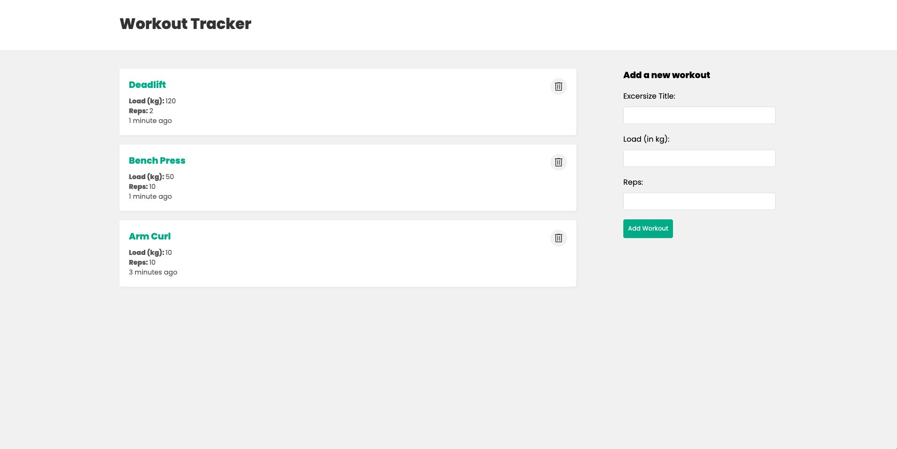
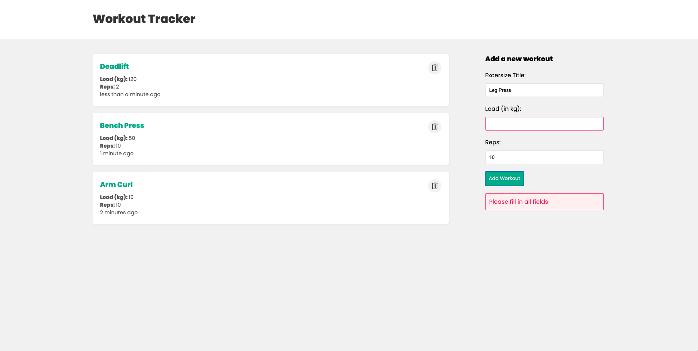

# [workout-tracker](https://workout-tracker-frontend-1gjy.onrender.com/) deployed on Render

## User stories
* As a user, I want to upload a workout record
* As a user, I want to delete a workout record

## Tech Stack
* Frontend: React, CSS
* Backend: nodejs with Express, RESTful API
* Database: mongodb, mongoose

## Skills Gained
* How to use React hooks: useState, useEffect, useContext, useReducer
* How to use RESTful API to communicate with frontend and backend
* How to setup frontend and backend from scratch

## Demo

## Future Work
* User Authentication

